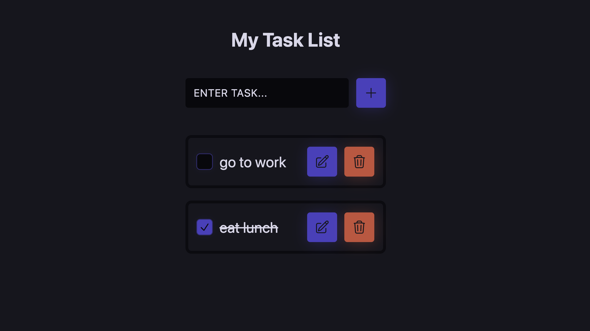

# React To-Do List

---

## Demo & Snippets

---

## Requirements / Purpose

### MVP

Create a React project that will allow the user to create, delete, edit and checkoff tasks. The project should include a list component to display each task when added and taskcards allowing the user to add, delete, edit and checkoff each task.

### Purpose of Project

The purpose of this project is to provide a practical example of building a simple web application using React. The project allows users to create and manage a list of tasks or items that they need to complete, and the application provides them with a simple interface to add, edit and delete items as needed.

Furthermore, it is a simple project that allows developers to understand the fundamentals of React and how to work with different React libraries and tools as well as practice using React hooks and managing state.

### Tech stacks used:

React: provides a simple and efficient wat to build reusable components, and can be easily updated and maintained, making it easier to manage the application's state and logic.

CSS: allows developers to create a visually appealing and intuitive user interface. CSS can be used to create different styles for different components, such as buttons, input fields, and list items. Furthermore, it allows developers to create responsive designs that work well on different screen sizes.

React and CSS can be used together to create a seamless and interactive user experience, allowing users to add, edit, and delete tasks with ease.

---

## Build Steps

### Prerequisites

To get started, you will need to have Google Chrome and Visual Studio Code installed on your system.

### Steps:

Here are the steps to set up the project:

1. Clone the repository to your local machine.
2. Open the repository in visual studio code.
3. Navigate to "react-todolist" using the Command Line Interface (CLI) and run "npm install" to install the necessary dependencies, followed by "npm run dev" to start the development server.
4. Open the Google Chrome browser and copy the local link provided in the command line into the browser search bar to view the application. Alternatively, press the link directory in the command line to open the browser holding "cmd" on mac or "ctrl" on windows whilst clicking the link.

---

## Design Goals / Approach

The goals of the project was to create an application that focused on the user's needs and goals in which the user interface should be intuitive and easy to use, with clear and concise visual aids and instructions for adding, editing, updating and deleting tasks.

The design was kept minimal so that it is simple and easy to understand and unnecessary features and functionality should be avoided to keep the interface clean and clutter-free.

Additionally, the design was created to work on a variety of devices and screen sizes.

---

## Features

- Responsive design: Ensuring that the portfolio is optimised for different screen sizes and devices, so viewers can easily access and navigate the website on desktop and mobile devices.
- Clean and modern design: Keeping the design and colour palette minimal makes the website visually appealing whilst the professional design reflects personal brand and style.
- The design of the application should be consistent throughout, with a consistent color palette, typography, and layout. This can help to create a cohesive user experience and make it easier for users to navigate and use the application.
- The inputted tasks are saved to local storage.

---

## Known issues

---

## Future Goals

- Create styling so users can switch between light mode and dark mode

---

## What did you struggle with?

- I struggled with making the list save to local storage as this was my first time learning how to do so.
- Had difficulties with update methods to edit the tasks.

---

## Further details, related projects, reimplementations

---

## Contact

Feel free to reach out to me via ashleykouch99@gmail.com for any questions or collaboration opportunites.
